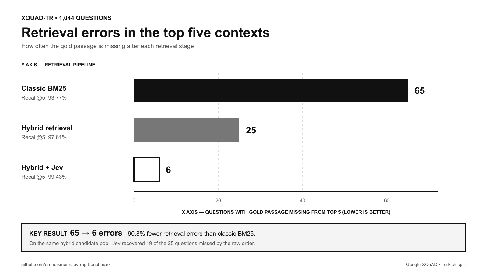
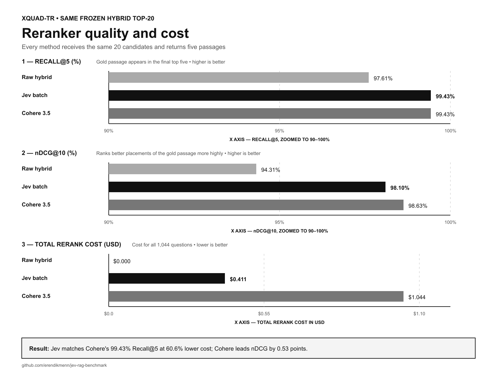
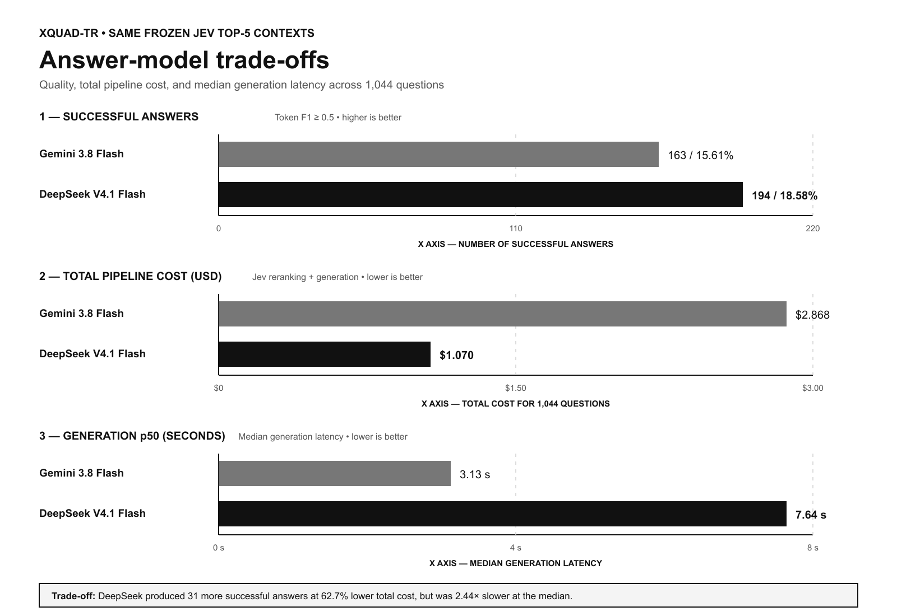

# jev-rag-benchmark

Reproducible, vendor-neutral experiments for measuring whether TypeSafe Jev improves a
small RAG system. “Jev wins” is not an assumption: quality, latency, and cost can improve,
stay flat, or get worse.

## Benchmark status — XQuAD-TR (2026-09-20)

The locked full benchmark contains **1,044 unique Turkish XQuAD questions** and a corpus of
240 passages. Published model and embedding calls use OpenRouter; no local LLM or local
embedding model is used. The first stage fuses BM25 with `baai/bge-m3`, exposes the same 20
candidates to every reranker, and gives the answer model the best five passages. The Jev
request was `typesafe/jev-1.13`; OpenRouter resolved it to
`typesafe/jev-1.13-20260917`.

### 1. Candidate retrieval ceiling

This table answers the first prerequisite question: *was the gold passage available to the
reranker at all?* A reranker cannot recover a passage outside its candidate pool.

| Candidate source | Candidate depth | Gold passage found | Candidate recall |
|---|---:|---:|---:|
| BM25 | top-5 | 979 / 1,044 | 93.774% |
| BM25 | top-20 | 1,009 / 1,044 | 96.648% |
| BM25 | top-50 | 1,020 / 1,044 | 97.701% |
| BM25 | top-100 | 1,028 / 1,044 | 98.467% |
| BM25 | all 240 | 1,044 / 1,044 | 100.000% |
| Hybrid BM25 + BGE-M3 | top-5 | 1,019 / 1,044 | 97.605% |
| Hybrid BM25 + BGE-M3 | top-20 | 1,039 / 1,044 | **99.521%** |
| Hybrid BM25 + BGE-M3 | top-50 | 1,044 / 1,044 | **100.000%** |

Full-depth hybrid fusion raises the top-20 ceiling by **2.873 percentage points** over BM25
alone, from 1,009 to 1,039 answer-bearing candidate sets.

### 2. Full reranker benchmark

Generation is disabled here, so the table isolates passage selection. All three rows use
the same 1,044 questions and the same frozen hybrid top-20 candidates.

| Reranking method | Recall@5 | Gold in top-5 | nDCG@10 | MRR@10 | Rerank p50 | Total rerank cost | Status |
|---|---:|---:|---:|---:|---:|---:|---|
| No reranker; hybrid order | 97.605% | 1,019 / 1,044 | 94.314% | 93.194% | 0.0 ms | $0.000000 | Full |
| **Jev 1.13 batch Noul** | **99.425%** | **1,038 / 1,044** | 98.097% | 97.637% | 532.0 ms | **$0.410866** | Full |
| Cohere Rerank 3.5 | **99.425%** | **1,038 / 1,044** | **98.626%** | **98.348%** | **466.1 ms** | $1.044000 | Full |

Jev and Cohere recover exactly the same number of gold passages into top-5. Jev costs
**60.6% less**, while Cohere leads Jev by 0.529 nDCG points and 65.9 ms at the median. Jev
adds **19 top-5 recoveries** and 3.783 nDCG points over the raw hybrid order, with zero API
fallbacks.

Raw rows: [`results/xquad-tr-hybrid-fullfusion20-a-d-o.jsonl`](results/xquad-tr-hybrid-fullfusion20-a-d-o.jsonl) ·
Report: [`reports/generated/xquad-tr-hybrid-fullfusion20-a-d-o/`](reports/generated/xquad-tr-hybrid-fullfusion20-a-d-o/)

### 3. Frozen-context answer generation

Both generators receive the **exact same frozen Jev top-5 context IDs**, so retrieval and
reranking variation cannot influence this comparison. “Successful answer” means token F1
>= 0.5 after citation markers are removed.

| Metric | Jev + Gemini 3.8 Flash | Jev + DeepSeek V4.1 Flash |
|---|---:|---:|
| Evaluation status | Full, 1,044 / 1,044 | Full, 1,044 / 1,044 |
| Resolved model | `google/gemini-3.8-flash` | `deepseek/deepseek-v4.1-flash` |
| Mean answer F1 | 27.274% | **29.191%** |
| Exact match | 0.096% | **0.862%** |
| Successful answers | 163 / 1,044 (**15.61%**) | **194 / 1,044 (18.58%)** |
| Valid citation IDs | 93.87% | **95.69%** |
| Abstention rate | 6.13% | **4.21%** |
| Wrong-answer flag | 78.26% | **77.20%** |
| Generation p50 / p95 | **3.128 s / 13.114 s** | 7.641 s / 46.537 s |
| Generation-only cost | $2.457358 | **$0.659245** |
| Jev + generation total | $2.868223 | **$1.070110** |
| Cost per successful answer | $0.017596 | **$0.005516** |

On paired questions, DeepSeek improves mean F1 by **1.91 points** (95% bootstrap CI +1.03
to +2.86) and success rate by **2.97 points** (95% CI +0.96 to +5.08). It produces 31 more
successful answers, lowers end-to-end cost by **62.7%**, and lowers generation-only cost by
**73.2%**. The trade-off is latency: its observed median generation time is 2.44x Gemini's
and its p95 is 3.55x Gemini's.

Paired report: [`reports/generated/gemini-vs-deepseek.md`](reports/generated/gemini-vs-deepseek.md)

### 4. Jev strategy ablations

These experiments test whether a more elaborate use of Jev improves the default batch
reranker. Sample results are explicitly marked and are not presented as full-set scores.

| Experiment | Scope | Recall@5 | nDCG@10 | Main effect | Decision |
|---|---:|---:|---:|---|---|
| Batch Noul reference | 200 questions | 99.00% | 97.893% | 529.2 ms p50; $0.078964 | **Default** |
| Pointwise Jev | 200 questions | 99.00% | 97.008% | No recovery; +80.8% latency; +56.5% cost | Do not use by default |
| 3-order permutation ensemble | 200 questions | 99.00% | 98.131% | +0.238 nDCG points; +10.9% latency; 3x cost | Optional stability mode |
| Multi-signal evidence router | 200 questions | 93.00% | 92.381% | Over-filtered evidence; 10 fallbacks; about 2x latency/cost | Security mode; recalibrate first |
| Full-corpus hierarchical Jev | 100 questions | 76.00% | 61.21% | Worse than BM25 top-5 at 97% Recall; $0.005061/query | Rejected as retriever replacement |
| Jev citation verification | 100 questions | 99.00% | 97.693% | All final cited claims verified; one regeneration; +3.7% total cost | Optional high-assurance mode |

The candidate-order audit used 50 questions and five permutations. Mean Spearman rank
correlation was 0.262, mean top-5 Jaccard was 0.288, and gold top-5 membership changed for
3/50 questions. The ensemble reduces this sensitivity, but the small quality gain does not
justify tripling default reranking cost on this dataset.

### 5. Current recommendation

- **Best measured quality/cost:** hybrid full-depth top-20 -> Jev batch top-5 -> DeepSeek
  V4.1 Flash.
- **Lower interactive latency:** the same retrieval/Jev path -> Gemini 3.8 Flash.
- **High-assurance output:** add Jev claim/source citation verification after generation.
- **Do not use Jev as the first-stage retriever:** BM25 + BGE-M3 should create a strong,
  bounded candidate pool first.
- **Do not enable evidence filtering globally:** calibrate its thresholds on the target
  corpus, especially for no-answer and adversarial documents.

Recall/nDCG and answer F1 measure different stages: **99.425% Recall@5 does not mean 99.425%
correct generated answers**. XQuAD references are short extractive answers, while the
generator can produce two sourced sentences; exact match is therefore deliberately harsh.
The wrong-answer flag is an automatic `non-abstaining F1 < 0.5` proxy, not human factuality
adjudication. Latency is observed OpenRouter route latency, not a universal TPS guarantee.

### 6. Visual benchmark

The charts below visualize the same locked results reported in the tables above. Their SVG
sources are committed next to the PNG files so labels, scales, and values remain auditable.



**How to read it:** the y-axis lists the retrieval pipeline, while the x-axis counts questions
whose gold passage is missing from the final top five. Lower is better. The labels below each
pipeline also report Recall@5, where higher is better.



**How to read it:** the first two x-axes show percentages and are explicitly zoomed to
90–100%; higher is better. The third x-axis shows total reranking cost in USD for all 1,044
questions; lower is better. The y-axis in every panel lists the reranking method. All methods
receive the same frozen hybrid top-20 candidates.



**How to read it:** the first x-axis counts answers with token F1 >= 0.5, where higher is
better. The next two x-axes show total pipeline cost and median generation latency, where lower
is better. Both generators receive the exact same frozen Jev top-five contexts, so this chart
isolates the answer-model trade-off.

The complete methodology, interpretation limits, confidence intervals, and artifact map
are also preserved in [`docs/benchmark-2026-09-20.md`](docs/benchmark-2026-09-20.md).

The project is based on LlamaIndex's MIT-licensed local FastAPI/Ollama RAG example at
commit `f475afd8a9bbda84f252567e045d89d07b5701b3`; see
[`docs/architecture.md`](docs/architecture.md) and [`NOTICE`](NOTICE).
The capped three-candidate comparison is in
[`docs/candidate-review.md`](docs/candidate-review.md).

## Install

Requirements: macOS/Linux, Python 3.11–3.13, `uv`, and an OpenRouter API key.

```bash
uv sync --extra dev
export OPENROUTER_API_KEY="..."
uv run jev-rag doctor
```

The optional `cross-encoder` extra is only for branch B and was not used in the published
OpenRouter comparison. `.env` is ignored by Git; no credential file is committed.

Optional FastAPI surface, retained from the selected upstream app shape:

```bash
uv run uvicorn jev_rag_benchmark.app:app --host 127.0.0.1 --port 8000
```

Jev is called through OpenRouter's Decisions endpoint with `OPENROUTER_API_KEY`.
Credentials remain server-side/environment-only. The CLI reports whether a key exists but
never prints it.

## Reproduce

```bash
# Download SciFact and XQuAD EN/TR, then normalize without committing raw data
uv run jev-rag data prepare

# Validate/materialize the deterministic index
uv run jev-rag index --dataset scifact

# One sourced baseline question through the capped OpenRouter config
uv run jev-rag ask "Türkiye'nin başkenti neresidir?" --dataset xquad-tr --branch A \
  --config-path configs/openrouter-smoke.yaml

# 25-query infrastructure smoke. Jev fixture is visibly marked; no paid calls.
uv run jev-rag benchmark smoke --dataset scifact --branches A,B,D --fixture-jev --skip-generation

# Preflight cost from the real top-20 candidate texts; makes zero API calls.
uv run jev-rag estimate --dataset scifact --jev-branches 1

# QA smoke with OpenRouter answer generation
uv run jev-rag benchmark full --dataset xquad-tr --branches A,D --limit 5 \
  --no-fixture-jev --no-skip-generation --config-path configs/openrouter-smoke.yaml

# Audit the first-stage ceiling, then run the locked full A/Jev/Cohere comparison.
uv run jev-rag retrieval-audit --dataset xquad-tr --candidate-ks 5,20,50,100,240 \
  --config-path configs/openrouter-hybrid-fullfusion-20.yaml
uv run jev-rag benchmark full --dataset xquad-tr --branches A,D,O \
  --no-fixture-jev --skip-generation \
  --config-path configs/openrouter-hybrid-fullfusion-20.yaml
uv run jev-rag report results/xquad-tr-a-d-o.jsonl \
  --output-dir reports/generated/xquad-tr-a-d-o

# Replay a generator over frozen Jev contexts. The command checkpoints every ten rows,
# resumes successful rows, retries empty OpenRouter generations, and supports sharding.
uv run python scripts/replay_generator.py \
  results/xquad-tr-hybrid-fullfusion20-a-d-o.jsonl \
  data/processed/xquad-tr/documents.jsonl \
  configs/openrouter-gemini-3.8-hybrid.yaml results/gemini-replay.jsonl \
  --source-branch D --target-branch G --concurrency 4

# Optional dev-only threshold calibration and candidate-order stability audit.
uv run jev-rag calibrate-jev --dataset xquad-tr --minimum-recall 0.95
uv run jev-rag jev-stability --dataset xquad-tr --limit 50 --permutations 5 \
  --config-path configs/openrouter-hybrid-fullfusion-20.yaml

# Real 25-query Jev smoke through OpenRouter, capped at $0.02.
uv run jev-rag benchmark smoke --dataset scifact --branches A,B,D \
  --no-fixture-jev --skip-generation --config-path configs/openrouter-smoke.yaml

# Larger real Jev run: first set an explicit positive max_budget_usd in a copied config.
# The default of 0 blocks every paid call.
cp configs/paid.example.yaml configs/paid.yaml
uv run jev-rag benchmark full --dataset scifact --branches A,B,D --config-path configs/paid.yaml

# Generate CSV/JSONL-derived Turkish report and SVG
uv run jev-rag report results/scifact-a-b-d.jsonl
```

`benchmark full` uses every selected test query unless `--limit` is passed. A/B/D/O use the
same frozen top-20 candidates and exactly five context documents. E applies the dev-selected
threshold. P is pointwise Jev; R is the multi-signal evidence router; S is the permutation
ensemble; H is full-corpus hierarchical Jev; V is batch Jev plus citation verification.
Every generator prompt has the same 6,000-character maximum context budget.

## Tests

```bash
uv run pytest
uv run ruff check .
```

Tests cover retrieval metrics, hybrid retrieval, EM/F1 citation handling, paired bootstrap
reproducibility, Jev Noul/Choice response parsing, resolved-model logging, evidence routing,
hierarchical and permutation reranking, citation verification, sharding, concurrent budget
accounting, empty-generation retries, fallback behavior, and the zero-budget safety gate.

## Results and costs

Each run writes JSONL, a downloadable flat CSV, and a manifest containing commit,
dependency versions, dataset hashes, requested models, price date, seed, prompt versions,
cache mode, and concurrency. Reports separate retrieval, reranking, generation, and
end-to-end latency; Jev, generator, retry/fallback, and local compute are not conflated.
Generator model, reasoning effort, token cap, measured usage, finish reason, and resolved
OpenRouter model are recorded per row or manifest. Frozen-context replay prevents a fresh
retrieval draw from contaminating generator comparisons.

Mock/fixture output has `run_kind=fixture` and must never be cited as a real benchmark.
Local models have zero API price but non-zero measured runtime; the report calls this out.
SciFact qrels measure retrieval only. XQuAD EN/TR answer references measure end-to-end EM/F1,
and languages are reported separately.

## Data licenses

Downloaded data is ignored by Git and regenerated by scripts:

- SciFact claims/evidence annotations: CC BY 4.0; abstracts: ODC-By 1.0.
- XQuAD: CC BY-SA 4.0.

The project source is MIT. Upstream attributions are in [`NOTICE`](NOTICE).

## Current limitations

- Jev 1.13 is strongest in English; these Turkish results must not be generalized to other
  languages or domains without evaluation.
- Candidate order affects Jev scores. The measured ensemble reduces that sensitivity but is
  not the default because it triples cost for a small nDCG gain.
- Passage instructions are treated as untrusted data. The evidence router can label likely
  injection/contradiction, but this is not a complete security boundary.
- Automatic XQuAD F1, wrong-answer flags, and Jev citation decisions are proxies, not human
  factuality adjudication.
